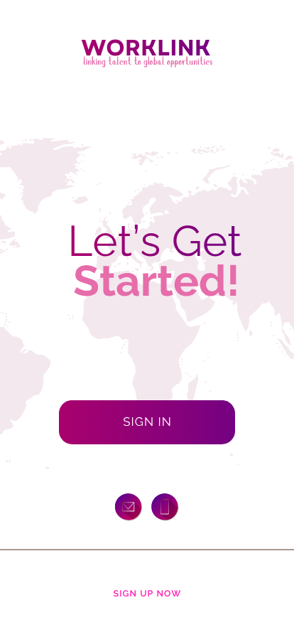
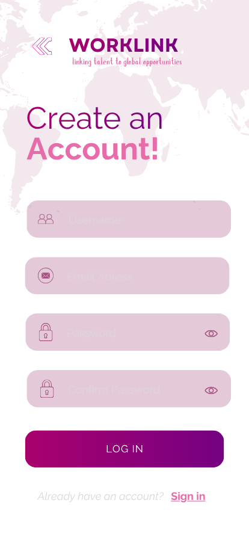
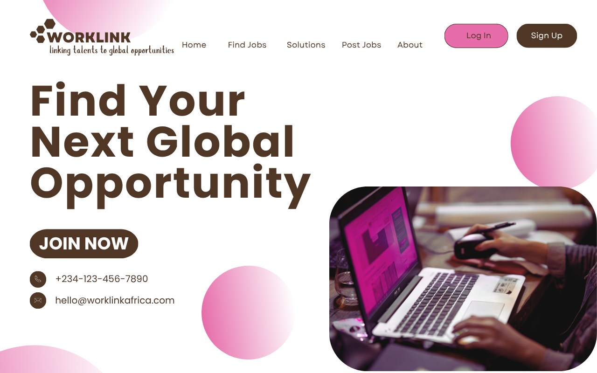
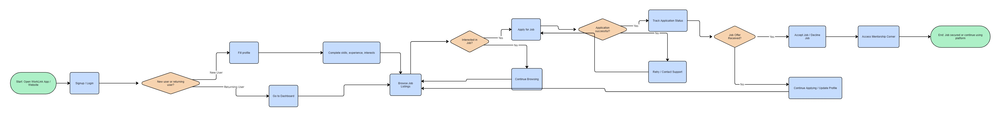
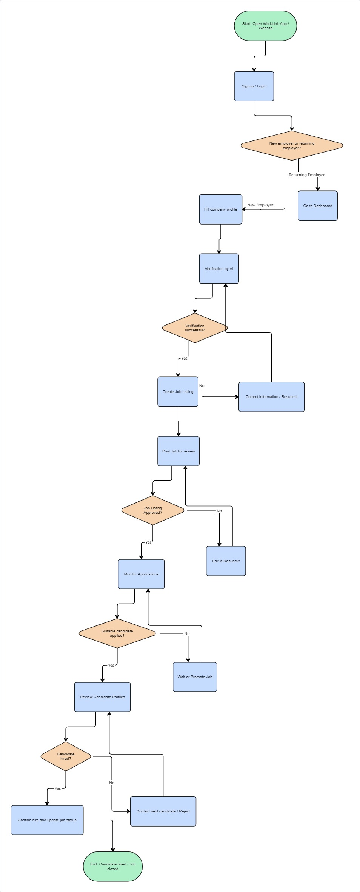

# WorkLink

## What WorkLink Does
WorkLink is a platform that connects **Africans with verified remote job opportunities**, making our continent’s talented workforce visible and accessible to employers globally. WorkLink aims to solve the problem of unverified and fake job listings by ensuring adequate screening is done for both the job seekers and job posters using AI technology.

WorkLink goes beyond just matching jobs, it provides a complete ecosystem for remote work:  
- Real-time application tracking  
- Career mentorship and guidance  
- Smart AI-driven matching based off on skills, experience, and interests

## Why WorkLink Matters
There is incredible talent in Africa, but much of it goes **unnoticed globally**. Many Africans struggle to access global and verified remote work opportunities. Meanwhile, global companies are constantly seeking reliable ways to **outsource skilled labor affordably**. Currently, there’s no strong bridge that allows African talent to be **verified and trusted** by employers abroad and vice versa.

WorkLink aims to bridge this gap by:  
- Making African professionals globally visible  
- Providing secure verification of job seekers and employers  
- Reducing scams and fraudulent listings  
- Ensuring underemployed talent finds opportunities that match their skills 

In short, WorkLink **empowers African talent** while helping global employers access reliable, verified remote labor.

## Who It’s For
- **Job Seekers / Students / Professionals:** Africans seeking remote full-time, part-time, contract, or internship opportunities  
- **Employers / Recruiters / Companies:** Global and local companies looking to hire verified African talent  
- **Career Mentors / Coaches:** Professionals who want to guide and support emerging talent  

## Key Features
- **AI-Powered Verification:** Ensures all job seekers and job listings are authentic  
- **Smart Job Matching:** Matches candidates to jobs based on skills, experience, and interests  
- **Live Application Tracker:** Reduces ghosting and improves communication  
- **Career Mentorship Corner:** Provides guidance and resources for professional growth  
- **Scam Detection & Alerts:** Protects users from fraudulent listings  

## Technologies
- **Frontend:** Figma (mockups), planned React (web) / Flutter (mobile)  
- **Backend:** Node.js / Django  
- **Database:** PostgreSQL / MongoDB  
- **AI/ML:** Python-based modules for verification, matching, and fraud detection  
- **APIs:** REST APIs for communication between frontend and backend  
- **Authentication:** JWT for secure login and role-based access  

## Product Mockups, User Flows & Wireframes
WorkLink’s **mobile and desktop app mockups** showcase a vibrant, creative design representing the energy and innovation of African youth.  

Additionally, we have:  
- **User Flow for Job Seekers:** Demonstrates how candidates navigate the platform, from browsing jobs to applying and tracking progress  
- **User Flow for Employers:** Shows how employers post verified jobs, screen candidates, and manage applications  
- **UI Wireframes (Mobile):** Includes landing page, signup, dashboard, job listings, and application tracking, showing how the platform should function on a phone  

### Wireframe Prototype
You can view the full wireframe prototype [here](https://miro.com/app/board/uXjVJtm1B6M=/?share_link_id=887790559828)

All mockups and userflows are included for viewing below, providing a complete visual understanding of WorkLink’s design and functionality.

## Mockups

Below are the visual mockups for the **WorkLink** landing pages across devices.

### Mobile Landing Page
| Screen 1 | Screen 2 | Screen 3 |
|-----------|-----------|-----------|
|  |  |  |

### Desktop Landing Page

## User Flows

These user flows illustrate how different users navigate and interact with the WorkLink platform.

### Job Seeker Flow

### Employer Flow

## Summary
WorkLink acts as a **link between African talent and global opportunities**, providing verification, mentorship, and seamless remote work experiences. Our mission is to make unknown talents visible, trustworthy, and globally accessible.