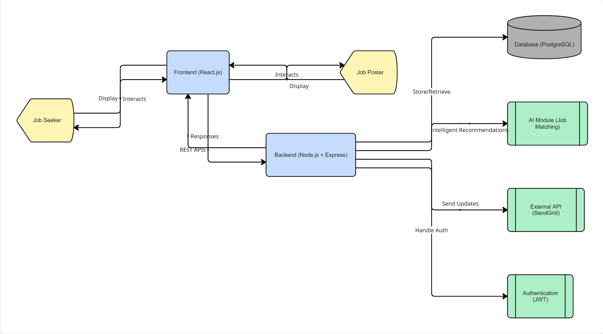
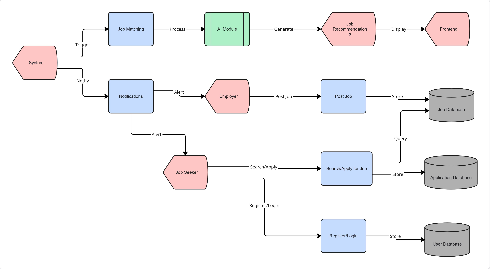
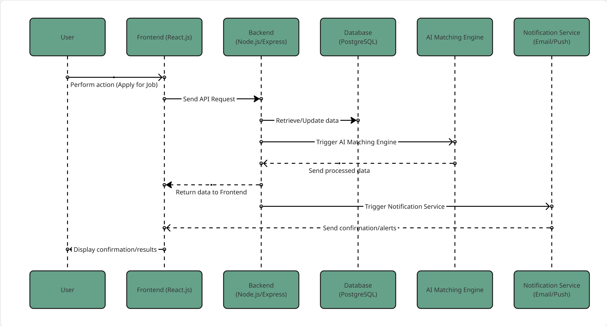

# WorkLink System Architecture

## Overview
WorkLink is a **remote job platform** designed to connect African talent with verified global opportunities. The system leverages **AI-powered verification**, smart job matching, and real-time communication between users and the platform. This document outlines the **technical blueprint**, including frontend, backend, database stack, component communication, and technical feasibility.

---

## Technology Stack

### **Frontend**
- **Purpose:** Handles user interactions, displays content, and collects input from users (job seekers, employers, mentors).  
- **Technologies:**
  - **React (Web):** For building responsive and dynamic web interfaces  
  - **Flutter (Mobile):** For cross-platform mobile applications  
  - **Figma (Design/Mockups):** For UI design and prototype visualization  
- **Key Responsibilities:**
  - Render job listings, dashboards, and application statuses  
  - Capture user inputs (signup, login, job posting, applications)  
  - Display mentorship resources and alerts  
  - Communicate with backend via REST APIs

---

### **Backend**
- **Purpose:** Processes requests, enforces business logic, communicates with the database, and integrates AI verification/matching.  
- **Technologies:**
  - **Node.js with Express** (JavaScript) or **Django** (Python) for scalable server-side development  
  - **Python AI modules** for:
    - Job seeker verification
    - Job poster verification
    - Matching algorithm between skills and job requirements
    - Scam/fraud detection
- **Key Responsibilities:**
  - Handle authentication and authorization  
  - Serve job listings and accept applications  
  - Run AI verification and matching  
  - Communicate data to frontend via REST APIs  
  - Store/retrieve user and job data from the database

---

### **Database Stack**
- **Purpose:** Securely store all user data, job listings, applications, AI results, and activity logs.  
- **Technologies:**
  - **PostgreSQL:** For structured relational data (users, job posts, applications)  
  - **MongoDB:** For unstructured/flexible data (logs, AI verification results, user activity)  
- **Key Responsibilities:**
  - Ensure data integrity and security  
  - Support queries for matching and reporting  
  - Provide scalable storage for growing user base

---

## Component Communication
The following diagram shows how the system components interact:

[User] 
   |
   v
[Frontend (React/Flutter)]
   |
   v
[Backend (Node.js/Django)] <---> [AI Modules (Python)]
   |
   v
[Database (PostgreSQL/MongoDB)]

**Explanation of Communication Flow:**
1. User → Frontend: Users interact via web or mobile app (signup, search jobs, apply).  
2. Frontend → Backend: Frontend sends requests to backend through REST API (secure, structured data).  
3. Backend → AI Modules: Backend sends relevant data to AI for verification, job matching, and fraud detection.  
4. Backend → Database: Backend stores and retrieves user profiles, job listings, application data, and AI results.  
5. Backend → Frontend: Backend responds with processed data, including verification status, job matches, application progress, and mentorship info.

---

## Technical Feasibility
WorkLink is **technically possible and feasible** due to the following reasons:

1. **Scalability:**  
   - Node.js/Django allows horizontal scaling to handle increasing users and requests.  
   - PostgreSQL and MongoDB support large datasets and structured/unstructured data simultaneously.

2. **Security:**  
   - JWT (JSON Web Token) based authentication ensures secure login and role-based access.  
   - Backend validation and AI verification reduce fraudulent activity.  

3. **Maintainability:**  
   - Modular design separates frontend, backend, AI modules, and database.  
   - Makes updates, debugging, and feature additions straightforward.  

4. **User Experience:**  
   - Real-time application tracking, mentorship dashboard, and notifications provide seamless interactions.  
   - Mobile-first wireframes ensure usability across devices.

5. **AI Integration:**  
   - Verification, matching, and scam detection modules can be implemented in Python and connected to the backend via APIs.  
   - These algorithms are feasible using available machine learning libraries like **scikit-learn**, **TensorFlow**, or **PyTorch**.

---

## Visuals / Diagrams
- **System Architecture Diagram:** High-level overview of frontend, backend, database, and AI modules  
- **Database Schema Diagram:** Tables for users, jobs, applications, AI results  
- **Data Flow Diagram:** Showing request/response between frontend, backend, AI, and database  
- **Component Interaction Diagram:** For developers to understand module communication  

# System Architecture Visuals

This document provides a detailed overview of the **WorkLink system design**, outlining how different components interact to support core platform functions — connecting African professionals to global remote opportunities.

---

## High-Level System Architecture

The diagram below shows the general structure of the system, including the frontend, backend, database, and AI integration layers.

---

## Data Flow Diagram (DFD)

The Data Flow Diagram illustrates how data moves between users, the frontend, backend, AI module, and database systems. It captures both request-response interactions and process flows.

---

## Database Schema Diagram

The Database Schema Diagram presents the core entities and their relationships, including users, employers, jobs, applications, AI results, activity logs, and system notifications, showcasing how data is structured to support all platform functionalities.

---

## Component Interaction Diagram

This diagram details how major components communicate with each other — including the user interface, API gateway, AI module, and database service.

---

## Summary

The **WorkLink** platform is built using a modular secure and scalable architecture that ensures smooth communication between system layers, efficient data handling, and AI-assisted features for matching professionals with global job opportunities.

Key highlights:
- Clear separation of frontend, backend, and AI services  
- Secure database communication with authentication and authorization layers  
- Optimized data flow for performance and scalability  
- Designed to integrate seamlessly with third-party APIs and remote job networks  

